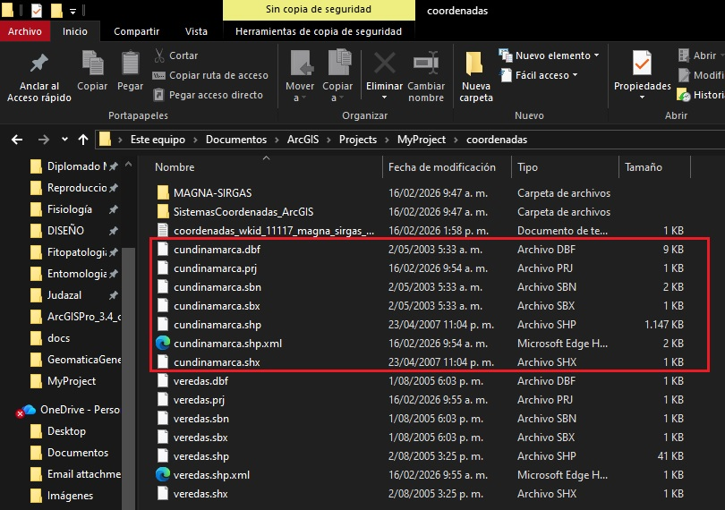
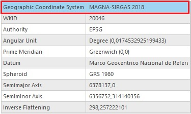

# CUESTIONARIO ❓

## 1️⃣ *¿Qué otros archivos conforman ese Shapefile?.*
Mediante el explorador de archivos de windows fue posible identificar 6 tipos de archivos diferentes (incluyendo el .prj) estos son:
  **a.** .dbf
  **b.** .sbx
  **c.** .shx
  **d.** .sbn
  **e.** .shp
  **f.** .prj

### *Archivos en el explorador.*

---

## 2️⃣ *¿"Colombia Bogotá zone" tiene relación con ARENA o MAGNA-SIRGAS? ¿Es geográfico o proyectado?.*
Sí, existe relación entre el Shapefile "veredas.shp" (con coordenadas de tipo "Colombia Bogotá zone") y con los 2 sistemas de referencia geodésicos, específicamente con MAGNA-SIRGAS, además de esto, es geográfico (como se muestra en la imagen #2).

---

### *Información veredas.shp*

---

## 3️⃣ ¿Cuales son los principales sistemas de coordenadas relacionados con Colombia?.

#### Tabla sistemas de coordenadas con código EPSG 

|   Sistemas de coordenadas |   Tipo    |   Datum/Sistema geodésico |   EPSG    |   Comentarios | 
|-------------------------|------------|-------------------------|------|------------|
|   MAGNA-SIRGAS 2018   |   Geográfico  |   MAGNA-SIRGAS 2018   |   4686    |   Sistema oficial moderno para Colombia, compatible GPS   |
|   Colombia Bogotá Zone    |   Proyectado  |   MAGNA-SIRGAS 2018   |   3116    |   Proyección Transversal de Mercator, origen Bogotá   |
|   Colombia Medellín Zone  |   Proyectado  |   MAGNA-SIRGAS 2018   |   3117    |   Proyección Transversal de Mercator, origen Medellín |
|   Colombia Cali Zone  |   Proyectado  |   MAGNA-SIRGAS 2018   |   3118    |   Proyección Transversal de Mercator, origen Cali |   
|   Colombia Bucaramanga Zone   |   Proyectado  | MAGNA-SIRGAS 2018 |   3119    |   Proyección Transversal de Mercator, origen Bucaramanga  |
|   Colombia Pereira Zone   |   Proyectado  |  MAGNA-SIRGAS 2018    |   3120    |   Proyección Transversal de Mercator, origen Pereira  |
|   Colombia Cúcuta Zone    |   Proyectado  |  MAGNA-SIRGAS 2018    |   3121    |   Proyección Transversal de Mercator, origen Cúcuta   |   
|   ARENA   |   Geográfico  |   ARENA   |   4284    |   Sistema antiguo, usado antes de MAGNA, no recomendado actualmente   |

---

## 4️⃣ “Geographic Transformation” ¿Es este el caso de esta transformación?. ¿Cómo es el proceso que ejecuta la herramienta? 
**A.** Sí es nuestro caso puesto que no se requiere realizar ninguna transformación por la siguiente razón: 
- El archivo de entrada se le asignan unas coordenadas especificas: municipios.shp → sistema geográfico GCS_Bogota lo que nos genera un archivo de salida: municipios_planas → sistema proyectado Colombia Bogota Zone.prf; es importante mencionar que ambos sistemas utilizan el mismo datum (MAGNA-SIRGAS 2018 o el datum local de Bogotá) y cuando no cambias de datum, no hace falta aplicar ninguna transformación geográfica.

**B.** El proceso que ejecuta la herramienta sigue estos pasos:

- Lee las coordenadas del archivo de entrada (municipios.shp) en latitud y longitud.

- Aplica la proyección del sistema de salida (Colombia Bogota Zone.prf) donde convierte latitudes y longitudes a coordenadas planas (X,Y en metros).

- Mantiene los atributos de cada entidad sin cambios (nombre, población, etc.).

- Crea un nuevo feature class independiente (municipios_planas) dentro de la geodatabase que tiene la particularidad de ser un Stand alone; es decir que no depende de datasets anteriores.

- Por ultimo, verifica que la geometría esté correcta en el nuevo sistema proyectado.

